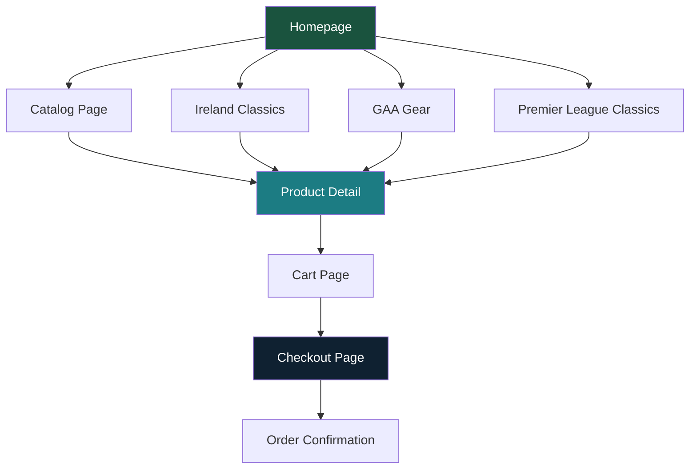

# Ériu Sports - Code Improvement Analysis

## Overview
This document provides a comprehensive analysis of the Ériu Sports Next.js e-commerce application, covering improvements for **Structure**, **SEO**, **Geo/Internationalization**, and **User UX/UI**.

---

## 1. STRUCTURE IMPROVEMENTS

### 1.1 Critical Issues

#### [Product Page - Client-Side Rendering](app/products/[slug]/page.tsx:1)
**Issue:** The product detail page uses `"use client"` and fetches product data client-side via `getProductBySlug()`. This is a major SEO and performance issue.

**Current:**
```tsx
"use client";
export default function ProductDetail({ params }: { params: Promise<{ slug: string }> }) {
  const { slug } = use(params);
  const product = getProductBySlug(slug);
```

**Recommended:** Convert to Server Component with static/dynamic generation:
```tsx
import { notFound } from 'next/navigation';
import { getProductBySlug } from '@/lib/products';
import { Metadata } from 'next';

export async function generateMetadata({ params }: { params: Promise<{ slug: string }> }): Promise<Metadata> {
  const { slug } = await params;
  const product = getProductBySlug(slug);
  if (!product) return { title: 'Product Not Found | Ériu Sports' };
  return {
    title: `${product.title} | Ériu Sports`,
    description: product.description,
    openGraph: { images: product.images },
  };
}

export default async function ProductDetail({ params }: { params: Promise<{ slug: string }> }) {
  const { slug } = await params;
  const product = getProductBySlug(slug);
  if (!product) notFound();
  // ... render (move interactive parts to client component)
}
```

**Impact:** Better SEO, faster initial load, proper SSR.

---

#### [Hardcoded Product Data in lib/products.ts](lib/products.ts:22-50)
**Issue:** All products are hardcoded with `category: "Jerseys"` regardless of actual category. The `getProductsByCollection` function exists but collection pages use it incorrectly.

**Current:**
```tsx
export const products: Product[] = (productsData as any[]).map((p, index) => {
  return {
    // ...
    category: "Jerseys",  // Always "Jerseys"!
    collection: p.collection || "ireland-classics",
```

**Recommended:** Map category from the JSON data properly:
```tsx
category: p.category || "Jerseys",
```

**Impact:** Broken filtering, incorrect catalog display.

---

#### [Inconsistent Routing Between ProductCard and Cart](components/catalog/ProductCard.tsx:28) vs [app/cart/page.tsx:58]
**Issue:** ProductCard links to `/products/${product.id}` but cart links to `/products/${item.product.id}`. The `id` field is set to `p.slug` in products.ts, but this is confusing naming.

**Recommended:** Standardize on `slug` for all routing. Rename `id` to `slug` consistently or add explicit `slug` field usage.

---

### 1.2 Moderate Issues

#### [Missing Metadata on Collection Pages](app/collections/ireland-classics/page.tsx:1)
**Issue:** Collection pages have no `generateMetadata` function, defaulting to the root layout metadata.

**Recommended:**
```tsx
export const metadata: Metadata = {
  title: 'Ireland Classics | Ériu Sports',
  description: 'Iconic Irish football heritage jerseys. From Italia 90 to USA 94.',
  openGraph: {
    title: 'Ireland Classics | Ériu Sports',
    description: 'Iconic Irish football heritage jerseys.',
    url: '/collections/ireland-classics',
  },
};
```

---

#### [Missing Metadata on Catalog Page](app/catalog/page.tsx:1)
**Issue:** No dynamic metadata based on category filter.

**Recommended:**
```tsx
export async function generateMetadata({ searchParams }: { searchParams: Promise<{ category?: string }> }) {
  const { category } = await searchParams;
  return {
    title: category ? `${category} | Ériu Sports` : 'Complete Collection | Ériu Sports',
  };
}
```

---

#### [No Sitemap or Robots Configuration](next.config.ts:1)
**Issue:** No sitemap generation or robots.txt configuration.

**Recommended:** Add to `next.config.ts`:
```tsx
const nextConfig: NextConfig = {
  images: { unoptimized: true },
  // Add sitemap configuration
};
```
Create `app/sitemap.ts` and `app/robots.ts`.

---

#### [Unused FilterBar Component](components/catalog/FilterBar.tsx:1)
**Issue:** FilterBar component exists but is not used in the catalog page.

**Recommended:** Either integrate it into the catalog page or remove it.

---

### 1.3 Minor Issues

#### [Image Optimization Disabled](next.config.ts:4-6)
**Issue:** `unoptimized: true` disables Next.js image optimization entirely.

**Recommended:** Investigate why this was disabled (likely Cloudflare Workers compatibility) and consider using `opennextjs-cloudflare` image optimization or a CDN solution.

---

#### [No Error Boundary](app/layout.tsx:1)
**Issue:** No error boundary for graceful error handling.

**Recommended:** Add `app/error.tsx` and `app/not-found.tsx`.

---

#### [Hardcoded Badge Logic](lib/products.ts:23-26)
**Issue:** Badges are assigned by array index, not product attributes.

**Recommended:** Base badges on product data (e.g., `isNew`, `isSellingFast` fields).

---

## 2. SEO IMPROVEMENTS

### 2.1 Critical Issues

#### [Minimal Root Metadata](app/layout.tsx:14-18)
**Issue:** Missing critical SEO metadata.

**Current:**
```tsx
export const metadata: Metadata = {
  title: "Ériu Sports | Designed in Ireland • Built for Performance",
  description: "Premium GAA sports merchandise and performance gear. Designed in Ireland, built for performance.",
};
```

**Recommended:**
```tsx
export const metadata: Metadata = {
  title: {
    default: "Ériu Sports | Premium Irish Football Heritage & GAA Gear",
    template: "%s | Ériu Sports",
  },
  description: "Premium retro football jerseys and GAA gear. Designed in Ireland, built for performance. Free shipping on orders over €49.",
  keywords: ["retro football jerseys", "Irish football", "GAA gear", "vintage soccer shirts", "Ireland classics"],
  authors: [{ name: "Ériu Sports" }],
  creator: "Ériu Sports",
  publisher: "Ériu Sports",
  metadataBase: new URL("https://eriusports.com"),
  alternates: {
    canonical: "/",
  },
  openGraph: {
    type: "website",
    locale: "en_IE",
    url: "https://eriusports.com",
    title: "Ériu Sports | Premium Irish Football Heritage",
    description: "Premium retro football jerseys and GAA gear.",
    siteName: "Ériu Sports",
    images: [{ url: "/og-image.jpg", width: 1200, height: 630 }],
  },
  twitter: {
    card: "summary_large_image",
    title: "Ériu Sports",
    description: "Premium retro football jerseys and GAA gear.",
    creator: "@eriusports",
  },
  robots: {
    index: true,
    follow: true,
    googleBot: { index: true, follow: true, "max-video-preview": -1, "max-image-preview": "large", "max-snippet": -1 },
  },
  verification: { google: "your-verification-code" },
};
```

---

#### [No Structured Data (JSON-LD)](app/page.tsx:1)
**Issue:** No structured data for products, organization, or breadcrumbs.

**Recommended:** Add JSON-LD to product pages:
```tsx
<script
  type="application/ld+json"
  dangerouslySetInnerHTML={{
    __html: JSON.stringify({
      "@context": "https://schema.org",
      "@type": "Product",
      name: product.title,
      description: product.description,
      image: product.images,
      brand: { "@type": "Brand", name: "Ériu Sports" },
      offers: {
        "@type": "AggregateOffer",
        priceCurrency: "EUR",
        lowPrice: product.price,
        highPrice: product.price,
        availability: "https://schema.org/InStock",
      },
    }),
  }}
/>
```

---

#### [No Breadcrumbs](app/products/[slug]/page.tsx:1)
**Issue:** Product pages lack breadcrumb navigation for SEO and UX.

**Recommended:** Add breadcrumb component with JSON-LD structured data.

---

### 2.2 Moderate Issues

#### [Missing Open Graph Image](app/layout.tsx:1)
**Issue:** No OG image specified for social sharing.

**Recommended:** Create and add `/public/og-image.jpg` (1200x630px).

---

#### [Non-Semantic HTML in Components](components/home/Hero.tsx:1)
**Issue:** Hero section uses `<section>` but lacks proper heading hierarchy.

**Recommended:** Ensure proper h1 → h2 → h3 hierarchy. Currently the Hero h1 is good, but ensure other sections use h2.

---

#### [Missing Alt Text Variations](components/home/Hero.tsx:52-53)
**Issue:** Alt text is static and not descriptive enough for accessibility/SEO.

**Recommended:** Use more descriptive alt text that includes product details.

---

## 3. GEO / INTERNATIONALIZATION IMPROVEMENTS

### 3.1 Critical Issues

#### [No i18n Configuration](next.config.ts:1)
**Issue:** No internationalization setup despite targeting Irish/European market.

**Recommended:** Add to `next.config.ts`:
```tsx
const nextConfig: NextConfig = {
  i18n: {
    locales: ['en', 'ga'],
    defaultLocale: 'en',
    localeDetection: true,
  },
};
```

---

#### [Hardcoded Euro Currency](lib/products.ts:49)
**Issue:** Currency is hardcoded to EUR with no geo-detection.

**Recommended:** Implement geo-based currency detection:
- Use Cloudflare headers (`cf-ipcountry`) or IP geolocation
- Support EUR, GBP, USD based on user location
- Store currency preference in localStorage

---

#### [No Geo-Based Shipping Info](lib/shipping.ts:1)
**Issue:** Shipping is flat rate with no country-specific pricing.

**Recommended:** Add country-based shipping calculation:
```tsx
export function calculateShipping(subtotal: number, country: string = 'IE'): number {
  if (subtotal > FREE_SHIPPING_THRESHOLD) return 0;
  const rates: Record<string, number> = {
    IE: 4.95,
    UK: 6.95,
    US: 12.95,
    EU: 7.95,
  };
  return rates[country] || SHIPPING_COST;
}
```

---

### 3.2 Moderate Issues

#### [No Language Attribute Detection](app/layout.tsx:26)
**Issue:** `<html lang="en">` is hardcoded.

**Recommended:** Make dynamic based on locale:
```tsx
<html lang={locale || "en"}>
```

---

#### [No Geo-Targeted Content](components/home/Hero.tsx:1)
**Issue:** Hero content is the same for all regions.

**Recommended:** Show region-specific messaging:
- EU: "Free shipping across Europe"
- UK: "Fast UK delivery, 2-3 days"
- US: "Now shipping to the USA"

---

#### [Missing hreflang Tags](app/layout.tsx:1)
**Issue:** No hreflang tags for international SEO.

**Recommended:** Add to layout metadata when i18n is implemented.

---

## 4. USER UX/UI IMPROVEMENTS

### 4.1 Critical Issues

#### [No Size Guide](app/products/[slug]/page.tsx:91-114)
**Issue:** Size selector has no link to size guide.

**Recommended:** Add size guide link/button near size selector:
```tsx
<div className="flex items-center justify-between">
  <h3>Size</h3>
  <button className="text-sm text-[var(--color-teal)] underline">Size Guide</button>
</div>
```

---

#### [No Product Quantity Selector on Product Page](app/products/[slug]/page.tsx:1)
**Issue:** Users can only add one item at a time from product page.

**Recommended:** Add quantity selector before "Add to Bag" button.

---

#### [No Loading States](app/products/[slug]/page.tsx:1)
**Issue:** No loading skeleton or spinner while product data loads.

**Recommended:** Add loading state or convert to server component.

---

#### [No Toast/Notification on Add to Cart](components/catalog/ProductCard.tsx:43-58)
**Issue:** Quick-add has no visual feedback after adding to cart.

**Recommended:** Add toast notification:
```tsx
const [showToast, setShowToast] = useState(false);
// After addItem:
setShowToast(true);
setTimeout(() => setShowToast(false), 2000);
```

---

### 4.2 Moderate Issues

#### [Mobile Menu Lacks Animation](components/layout/Navbar.tsx:91-105)
**Issue:** Mobile menu appears/disappears instantly without transition.

**Recommended:** Add CSS transition or use a slide-down animation.

---

#### [No Search Functionality](components/layout/Navbar.tsx:1)
**Issue:** No search bar in navigation.

**Recommended:** Add search icon that expands to search input.

---

#### [No Wishlist/Favorites Functionality](app/products/[slug]/page.tsx:141-147)
**Issue:** Heart button exists but does nothing.

**Recommended:** Implement wishlist functionality with localStorage.

---

#### [No Product Reviews](app/products/[slug]/page.tsx:1)
**Issue:** Product data includes `rating` and `reviewCount` but no review display.

**Recommended:** Add review section with star ratings and review content.

---

#### [Cart Page Links Use product.id Instead of product.slug](app/cart/page.tsx:58)
**Issue:** Product links in cart use `item.product.id` which maps to slug, but naming is confusing.

**Recommended:** Use `item.product.slug` explicitly for clarity.

---

#### [No Back to Top Button](app/page.tsx:1)
**Issue:** Long homepage has no scroll-to-top button.

**Recommended:** Add floating back-to-top button that appears on scroll.

---

#### [Newsletter Form Has No Backend Integration](components/home/JoinMovement.tsx:1)
**Issue:** Email submission only shows success message locally.

**Recommended:** Connect to email service (Mailchimp, ConvertKit, etc.).

---

### 4.3 Minor Issues

#### [Inconsistent Color Usage](components/home/Hero.tsx:1) vs [app/collections/ireland-classics/page.tsx:10]
**Issue:** Some components use CSS variables (`var(--color-emerald)`), others use hardcoded values (`#1A533E`).

**Recommended:** Standardize on CSS variables throughout.

---

#### [No Footer Links Are Functional](components/layout/Footer.tsx:1)
**Issue:** All footer links point to `#`.

**Recommended:** Create placeholder pages or remove links until pages exist.

---

#### [No Accessibility Testing](components/layout/Navbar.tsx:1)
**Issue:** Limited ARIA labels and keyboard navigation support.

**Recommended:** Add proper ARIA labels, focus management, and keyboard navigation.

---

#### [No 404 Page](app/)
**Issue:** No custom 404 page exists.

**Recommended:** Create `app/not-found.tsx` with branded 404 design.

---

## 5. PRIORITY RECOMMENDATIONS

### High Priority (Do First)
1. **Convert product page to Server Component** - Critical for SEO
2. **Add comprehensive metadata** to all pages
3. **Fix category mapping** in products.ts
4. **Add structured data (JSON-LD)** to product pages
5. **Add cart notification** on add-to-cart

### Medium Priority
6. **Implement i18n** for Irish/European market
7. **Add geo-based currency/shipping**
8. **Create sitemap and robots.txt**
9. **Add size guide** to product pages
10. **Implement wishlist** functionality

### Low Priority
11. Add search functionality
12. Add product reviews section
13. Create custom 404 page
14. Add back-to-top button
15. Standardize CSS variable usage

---

## 6. ARCHITECTURE DIAGRAM



---

## 7. QUICK WINS

These changes can be implemented quickly with significant impact:

1. **Add `metadataBase`** to layout for proper canonical URLs
2. **Create `app/not-found.tsx`** for better 404 experience
3. **Add `sizes` prop** to all Image components for better LCP
4. **Add `rel="noopener"`** to external social links
5. **Add `aria-current="page"`** to active nav links
6. **Create OG image** for social sharing
7. **Add loading skeletons** to product grids
